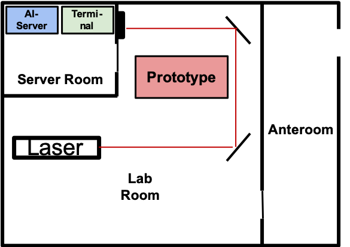

# second-door
Second Door Puzzles

To open the second door, 3 puzzles must be solved.
These puzzles are called Stages in the following.

# Stage 1 - Breaking the lock of the fusebox
In the first stage the group has to crack the lock of the fusebox. A laser somewhere in the room is to be used. In order to make the laser beam visible, a spray bottle, a fog machine or a kind of gas can be used. There is a lock on the fusebox which can only be opened when the laser beam is aimed at it. To do this, the group must use mirrors to divert the laser beam through the entire room. The 4 mirrors that can be used are mounted on a wall with magnets. This hides them, and the group must come up with the idea of using the mirrors. 

The lock on the fusebox measures the duration or intensity of the incident laser beam. So that only red laser light can open the lock, appropriate color filters must be attached. For example, a photodiode can be used to detect the incident light beam. The use of a small microcontroller is recommended for the readout of the sensor. The progress of this crack process is visualized with LEDs arranged in a circle. Once this color circle is closed, the microcontroller gives a signal to an actuator so that the lid of the fusebox opens. This completes the first stage. 

!!Hier Bild vom Schloss einfügen!!

Hints: Laser warning symbols on lock and laser

# Stage 2 - Restoring the power supply

# Stage 3 - Breaking the biometric lock
