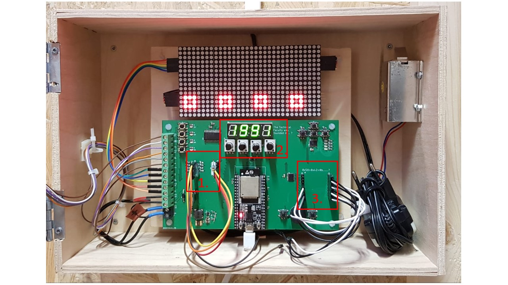
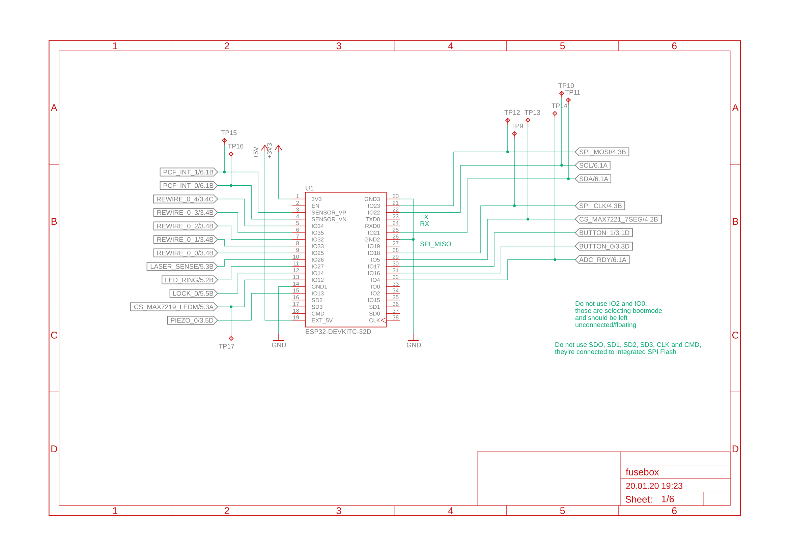
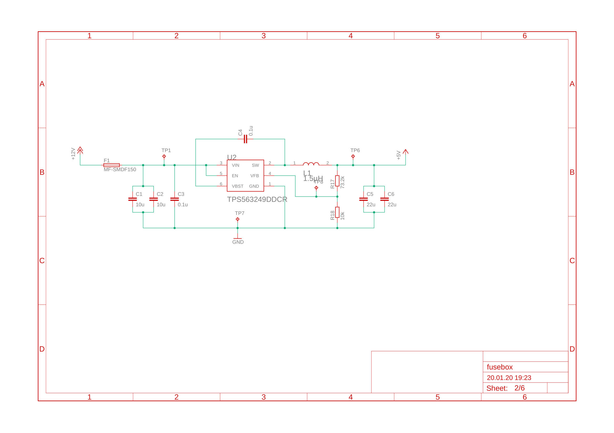
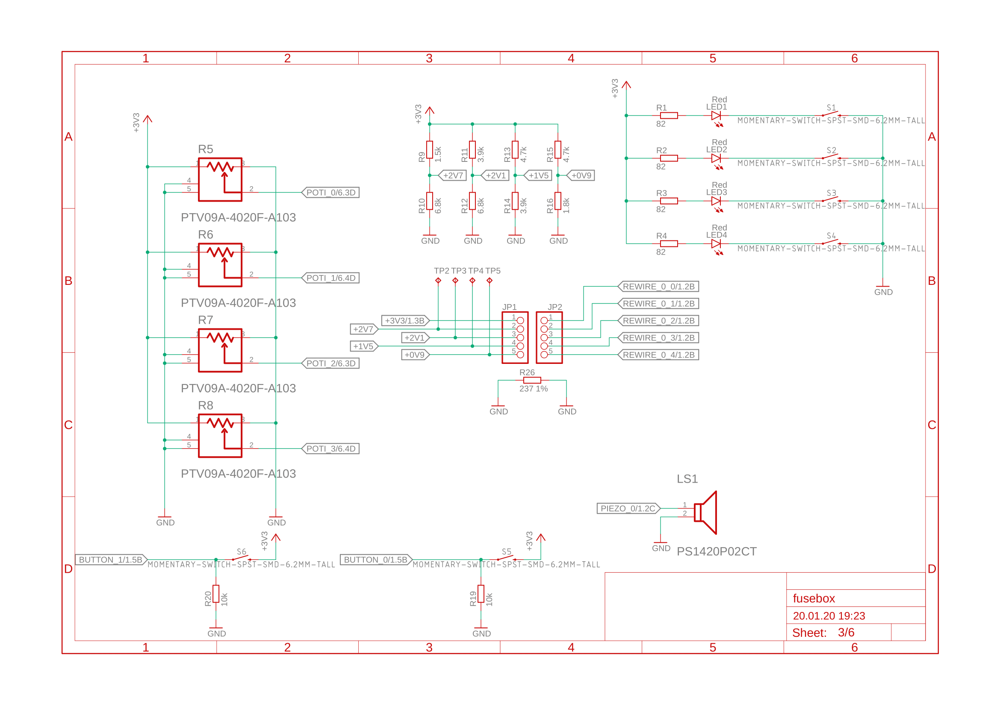
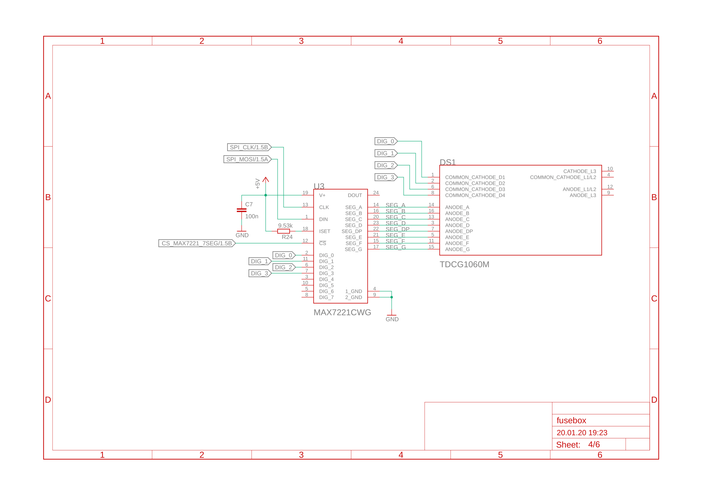
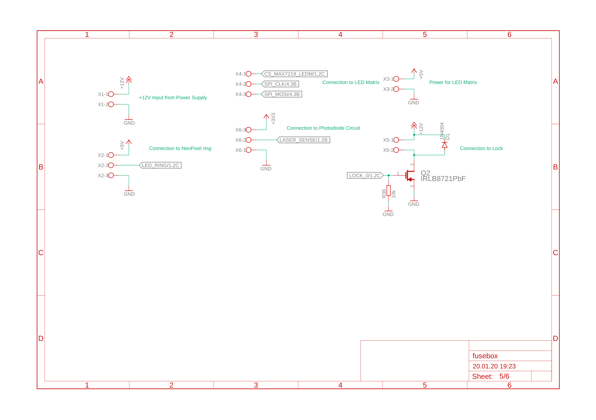
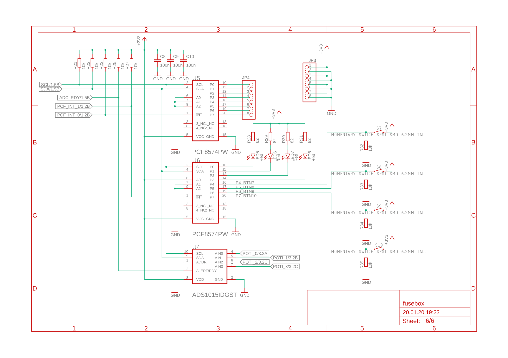
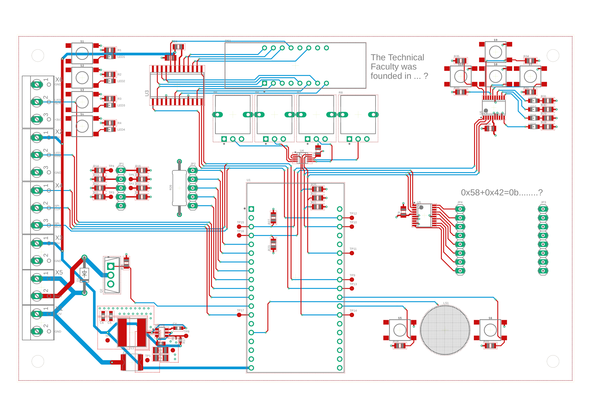
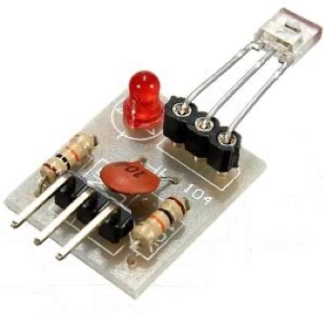
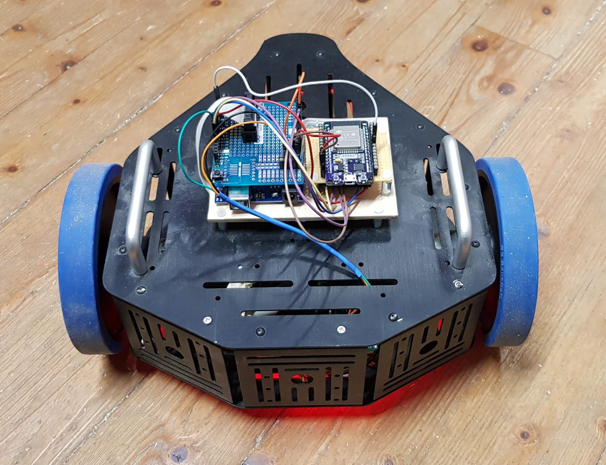

# Implementaion

In this file we are going to show and document the main implementation tasks.

# General

 

Figure 1: Visualization for the communication structure

# Fuse Box

 

Figure X: Design fuse box

 

Figure X: Finished box with marked riddles

## PCB

In the following images, you can see the schematics of the fusebox. Page 1 shows the connections between ESP32 and all logic signals. The power supply, which is on page 2, converts 12V DC to 5V @ 3A. Connections to mechanical and optical parts of the PCB, e.g. potentiometers, pinheader, leds, buttons and piezobuzzer. The circuit of the seven segment display, which shows the setting of the potentiometers, can be seen in page 4. We used a MAX7221, a serially interfaced (SPI) 8 bit current sink, which is often used as led driver. On page 5, connections to screw terminal blocks are shown. With those, one can connect external peripheral elements to the PCB. Finally, on page 6 you can see the circuit of I2C components. We used two PCF8574 8 bit I2C I/O port expanders, and one ADS1015 12 bit 4 channel delta-sigma I2C ADC. Both port expanders are used for additional peripheral elements, e.g. readout of second rewiring puzzle, readout of additional buttons and driving some leds. An external ADC was necessary, since we couldn't use some internal ADC pins of the ESP32, because they could influence boot options on startup in case they are connected to our potentiometers.

  
  
  
  
  
  

  Figure X: schematics of fusebox pcb

The shown schematic was used to design the pcb, pictured in figure XX. Initally, a 4 layer setup should be used, but to keep the price low, we decided to use a 2 layer setup, at the expense of signal quality. Reducing the number of layers was still possible, since we designed the PCB very forsighted (top/vertical and bottom/horizontal layer should have been used for signals, 2 and 15 for GND and power). The shown design contains both mounting techniques (SMD and THT), preferred package size is 0805. We ordered prototypes of this PCB at JLC PCB in China, the delivered pcbs were fully functional. After manually soldering all parts to pcb, we tested and programmed all functionality. Apart from 1 badly designed pad, everything worked fine and the board is fully functional.  

  

  Figure X: design of fusebox pcb

The assembled, mounted and connected pcb is shown in figure XX.

## Door

The laser is used to melt the lock. [LED ring](https://www.adafruit.com/product/2855) is used to indicate the status. 

 

Figure X: LEDs for indicating status of melting lock process

  
The laser beam is diverted by the mirrors and hits the detector visible below. The detector is equipped with a photodiode and an integrated comparator, which outputs a logical one when it detects a laser beam. The high response time of the diode allows to modulate a frequency to the laser and to detect this. The frequency is needed to prevent the puzzle from being bypassed by a flashlight. The signal is passed to an input of the ESP32 and this is sampled. A sequence of six samples is stored and checked for the equivalent number and order of zeros and ones. If this is given, the first LED of the ring is set to green. This is repeated until all sixteen LED's are green. Then the LED ring flashes three times to signal that the puzzle is solved. To increase the difficulty, a green LED is set to red again after one second to increase the difficulty.

 

Figure X: Sensor to detect the laser beam

# Laser + Box

[Laser](https://www.adafruit.com/product/1054) 

The white circle shown in the figure below is lighted with LEDs. This is going to be used to get the attention of the participants.

 

Figure X: Case for laserdiode

# Button to open door

To open the door a button has to be pushed with the robot. The button needs to communicate with the rest of the room. To give a hint it should be possible to light it up.

 

Figure X: Push button to open the door inside the server room

# Cat flap

Not decided yet!

**Problem**: sliding door does not allow much space for stepper/linear track/..

Possible solutions:

* FuseBox switches on the light inside the server room -> now robot can be seen inside the room
* usual cat flap with small lock

# Robot with controller

The robot will be controlled with an wireless PS2 controller which is attached to the wall. There exists a [library](http://www.billporter.info/2010/06/05/playstation-2-controller-arduino-library-v1-0/) to read out the commands.

  
   

Figure X: PS2 controller wireless with pinout

As chassis for the robot an old prototype from the university is used. There is already some electronic to controll the two dc-motors.

 

Figure X: Pinout for existing robot electronic

The pins "motor A1" and "motor A2" are used to controll the left wheel of the robot. Pins "motor B1" and "motor B2" for the right wheel. A LED is used to visualize if the battery of the robot is low. Furthermore there are LEDs "arround" the robot to attract attention of the participants.

 

Figure X: Robot with LEDs

