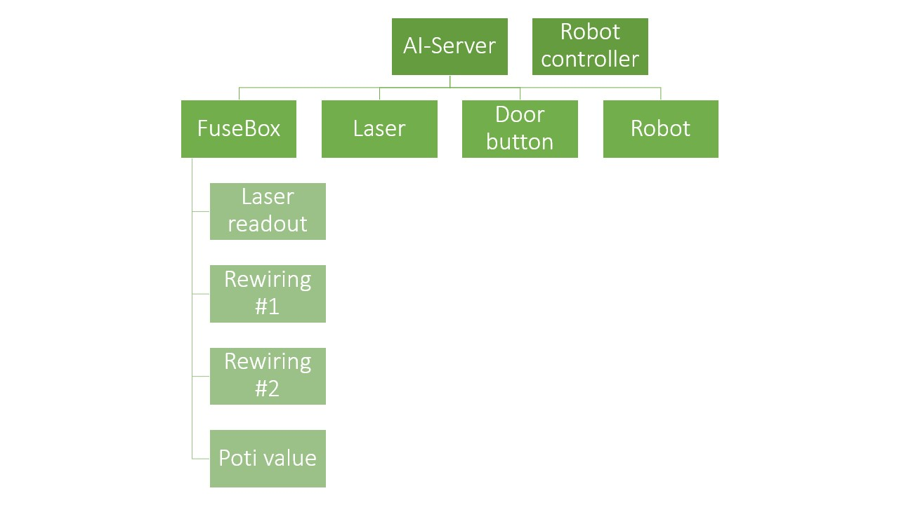
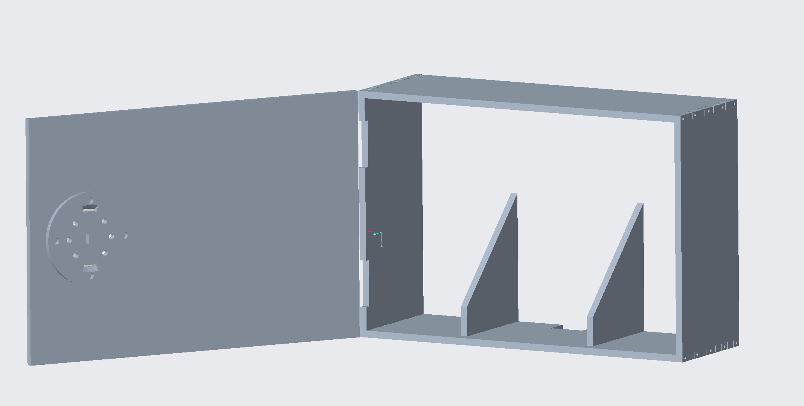
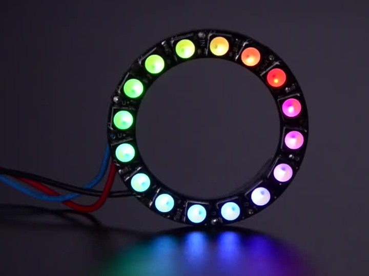
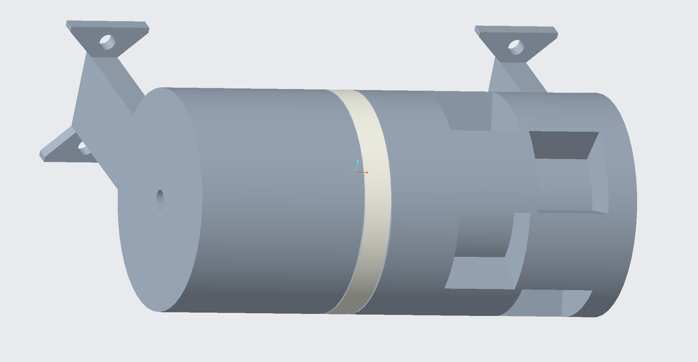
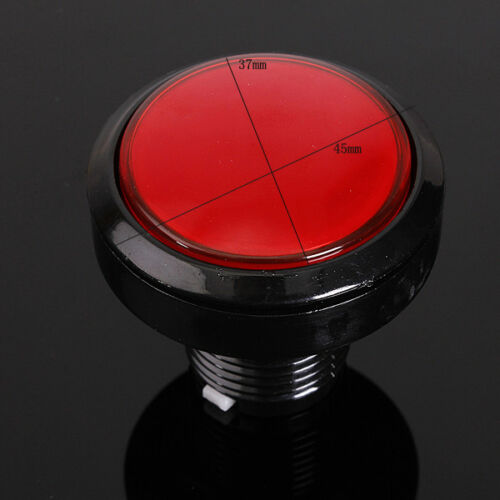
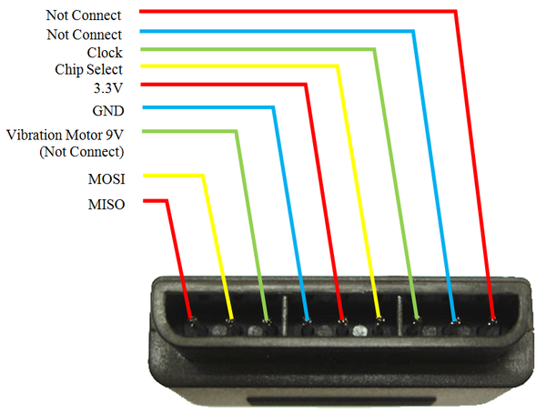
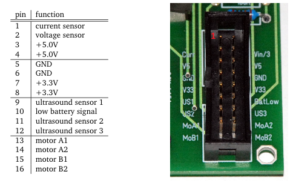

# Implementaion

In this file we are going to show and document the main implementation tasks.

# General

 

Figure 1: Visualization for the communication structure

# Fuse Box

 

Figure X: Design fuse box

## Rewiring

----->TODO<-----

## Door

The laser is used to melt the lock. [LED ring](https://www.adafruit.com/product/2855) is used to indicate the status. 

 

Figure X: LEDs for indicating status of melting lock process

  
When the laser beam hits the sensor, the LEDs change from red to green one after the other. If nothing is detected by the sensor, the LEDs turn red again to simulate cooling.

# Laser + Box

[Laser](https://www.adafruit.com/product/1054) 

The white circle shown in the figure below is lighted with LEDs. This is going to be used to get the attention of the participants.

 

Figure X: Case for laserdiode

# Button to open door

To open the door a button has to be pushed with the robot. The button needs to communicate with the rest of the room. To give a hint it should be possible to light it up.

 

Figure X: Push button to open the door inside the server room

# Cat flap

Not decided yet!

**Problem**: sliding door does not allow much space for stepper/linear track/..

Possible solutions:

* FuseBox switches on the light inside the server room -> now robot can be seen inside the room
* usual cat flap with small lock

# Robot with controller

The robot will be controlled with an wireless PS2 controller which is attached to the wall. There exists a [library](http://www.billporter.info/2010/06/05/playstation-2-controller-arduino-library-v1-0/) to read out the commands.

  
   

Figure X: PS2 controller wireless with pinout

As chassis for the robot an old prototype from the university is used(Picture will follow). There is already some electronic to controll the two dc-motors.

 

Figure X: Pinout for existing robot electronic

The pins "motor A1" and "motor A2" are used to controll the left wheel of the robot. Pins "motor B1" and "motor B2" for the right wheel. A LED is used to visualize if the battery of the robot is low. Furthermore there are LEDs "arround" the robot to attract attention of the participants.
