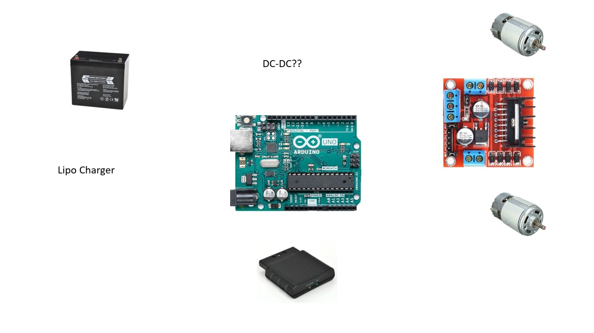

# Implementaion

In this file we are going to show and document the main implementation tasks.

# General

 

Figure 1: Visualization for the communication structure

# Fuse Box

# Laser + Box

# Button to open door

# Cat flap

Maybe outsourcing to "door team"

# Robot with controller

The robot will be controlled with an wireless PS2 controller which is attached to the wall. There exists a library to read out the commands [Link](http://www.billporter.info/2010/06/05/playstation-2-controller-arduino-library-v1-0/).

  
   

Figure X: PS2 controller wireless with pinout

Possible hardware implementation in figure below.

 

Figure X: Visualization for the possible robot hardware
